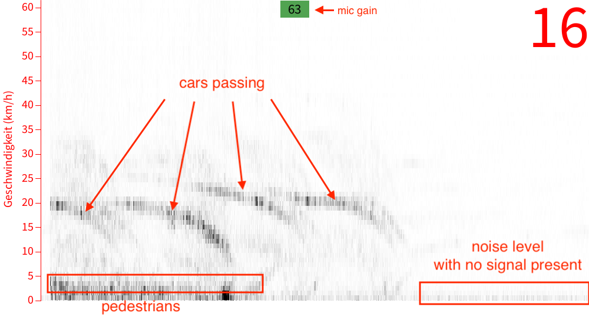
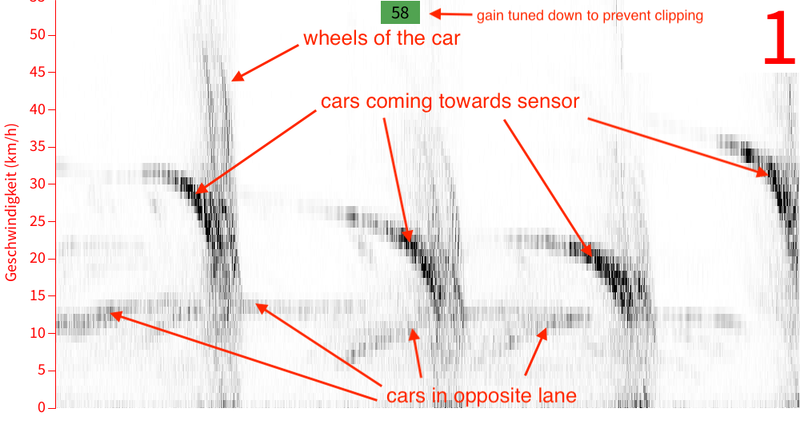

# Teensy Audio Board Prototype

This prototype works with the [IPS-354](https://media.digikey.com/pdf/Data%20Sheets/InnoSenT/200730_Data%20Sheet_IPS-354_V1.5.pdf) Radar Sensor from InnoSenT connected directly to the mic input of the [Teensy Audio Board](https://www.pjrc.com/store/teensy3_audio.html). The IPS-354 has a builtin gain of 27dB. The mic input of the audio board can regulate it's gain from 0 to 63dB. Together that's enough to detect cars, pedestrians and bicycles from the third floor of a building. When measured directly at the edge of the street the signal goes into clipping, so that the mic gain has to be set to about 55 to 58 dB. 

The teensy is programmed to continuously calculate a 1024 point FFT and transmit the data over Serial to the computer. The data are taken there by a [Processing](https://processing.org/) Script and visualized as a [waterfall diagram](https://en.wikipedia.org/wiki/Waterfall_plot). Additionally the Teensy calculates the frequency with highest amplitude which is optionally drawn as a line into the graph. This represents the mean speed of a moving object detected by the radar. 

The conversion from FFT bin to frequency is:

fft_bin_width = sample_rate/1024 = 44100 Hz/1024 = 43.0 Hz

The conversion from frequency to speed (at optimal angle, meaning the object comes directly onto the sensor) is:

speed = frequency/44

The Teensy also detects clipping with the `peak` function. If peak is returned as 1 the signal is in clipping. This is shown in the app as a green rectangle that turns red. With the <kbd>+</kbd> and <kbd>-</kbd> keys the gain can be regulated up or down to prevent clipping. Also the scale can be changed with the up and down arrows better see the lower speeds. You can also take a screenshot of the current view by pressing <kbd>s</kbd>.

Here a measurement done from 2m distance from the street edge. 



Here a measurement with a pedestrian up close where arm and leg movement can be seen in the signal. Cars are on the opposite side of the street and hence with fainter signal:


Here a measurement closer to the street with cars traveling both directions:	



## Wiring

| IPS-354           | Audio Board | Teensy |
| ---------------- | ----------- | ------ |
| Pin 2 (enable)   | -           | Pin 22 |
| Pin 3 (Vcc)      | -           | Vcc    |
| Pin 4 (Gnd)      | Mic Gnd     | Gnd    |
| Pin 5 (signal I) | Mic         | -      |

## 32bit Audio Library

To get better input resulution we use a 32bit audio library that was forked from the original Teensy Audio library:

[OpenAudio_ArduinoLibrary](https://github.com/chipaudette/OpenAudio_ArduinoLibrary)

Similar to the original audio library it has a Design tool:

[OpenAudio_Design_Tool](http://www.janbob.com/electron/OpenAudio_Design_Tool/index.html)

## Serial

The teensy opens two serial connections over usb. The first one `Serial` is used for data transmission to the processing visualisation script. 
The second one `SerialUSB1` is used for debugging.

It is important to set the Arduino IDE to dual serial: "Tools > USB Type: Dual Serial".

More infos under https://github.com/TeensyUser/doc/wiki/Serial and https://www.pjrc.com/teensy/td_serial.html

## IQ FFT

The 32bit audio library supports complex FFT calculation with I and Q channel. The [IPS-354](https://media.digikey.com/pdf/Data%20Sheets/InnoSenT/200730_Data%20Sheet_IPS-354_V1.5.pdf) sends 
I and Q signals from which the direction of the radar signal can be derived. To record I and Q signal we have to use the linein input instead of the mic input. This has only 0-22dB gain 
instead of up to 63dB gain on the mic input. But it offers two channels that we need for the IQ signal. The input sensitivity seems enough for the IPS-354.

We have done a correction for I-Q imbalance after [this instruction](https://www.faculty.ece.vt.edu/swe/argus/iqbal.pdf).

We develop this type of data analysis in the [IQ-fft branch](https://github.com/fablabcb/CityRadar/tree/IQ-fft/Teensy_prototype). 

The wiring is as follows:

| IPS-354           | Audio Board | Teensy |
| ---------------- | ----------- | ------ |
| Pin 2 (enable)   | -           | Pin 22 |
| Pin 3 (Vcc)      | -           | Vcc    |
| Pin 4 (Gnd)      | Linein Gnd L| Gnd    |
| Pin 5 (signal I) | Linein L    | -      |
| Pin 6 (signal Q) | Linein R    | -      |

## Writing to SD card

The program writes FFT data to the SD card (if present). The format is one 32bit unsigned integer timestamp in milliseconds since the start of the program
followed by 1024 times 32bit floats of the FFT bins in dBFS. This repeats for as long as the program was running.

At the beginning there is a file header containing:

- file_version (uint 2 bytes)
- timestamp (uint 4 bytes)
- fft_bins (uint 2 bytes)
- iq_measurement (bool 1 byte)
- sample_rate (uint 2 bytes)

In general every 12 milliseconds one dataset is written. Sometimes there seem to be hookups where there is longer times between datasets (up to 100 milliseconds).

The file `read_binary_file.R` shows how to read this dataset into R.

### SD noise problems

At the moment writing to SD creates noise in the data.

Some ideas how to tackle this:

- Some ideas from here: [How-to-avoid-noise-when-writing-to-the-microSD](https://forum.pjrc.com/threads/25326-How-to-avoid-noise-when-writing-to-the-microSD)
- change main clock speed -> didn't improve noise
- change slew rate of the pins: https://www.pjrc.com/teensy/IMXRT1060RM_rev2.pdf#page=695 with `IOMUXC_SW_PAD_CTL_PAD_GPIO_B0_00 = 0b0000'0000'0000'0000'0001'0000'1011'0000;`
- add condensators to buffer high Vcc demands
  - 10kOhm to buffer sensor input voltage didn't help
- use SD card of Teensy 4.1 instead of the audioshield. This itself doesn't improve. But maybe the SD pins to the audioboard should not be connected?
- pause data aquisition while writing to SD

## Real time clock

To add correct timestamps to the stored data we use the internal real time clock (RTC) of the Teensy. A coin cell battery needs to be connected to the VBat input 
to keep the internal RTC running. More on this here: [Teensy Time library explanation and examples](https://www.pjrc.com/teensy/td_libs_Time.html).

The Teensy uses the [Arduino time library](https://playground.arduino.cc/Code/Time/). 
Since at 44100 kHz we get a 1024 point FFT every 12 milliseconds a sub-second time resolution is needed.
The [millis function](https://www.arduino.cc/reference/en/language/functions/time/millis/) gives back milliseconds since start of the processor and can
complement the timestamp from the Time library. 

TimeSerial example under `File > Examples > Time > TimeSerial` shows how to set the rtc time via serial input.
Here is a forum Thread on [how to access the internal RTC in a Teensy 4.0](https://forum.pjrc.com/threads/60317-How-to-access-the-internal-RTC-in-a-Teensy-4-0).

From the Linux command line you can set the clock on the Teensy with:

```
date -u +T%s > /dev/ttyACM0
```
The command sends the letter "T" followed by the current time. Replace `ttyACM0` with your serial device name. 
`-u` sets the time as [Unix time](https://en.wikipedia.org/wiki/Unix_time). 